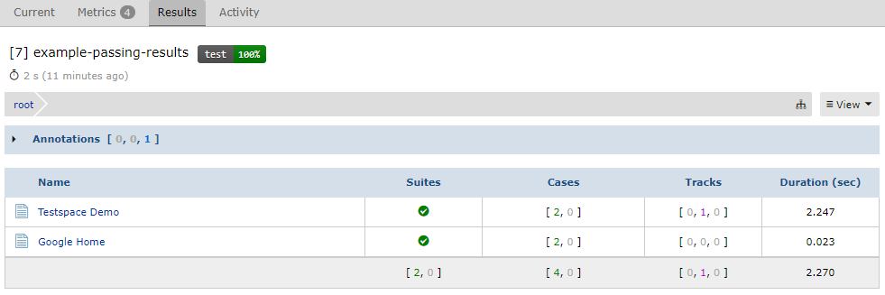
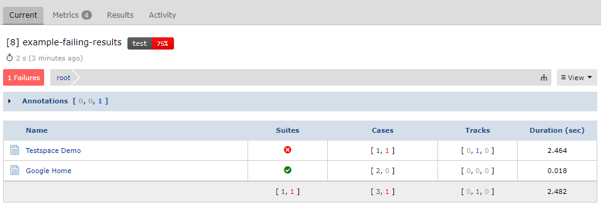
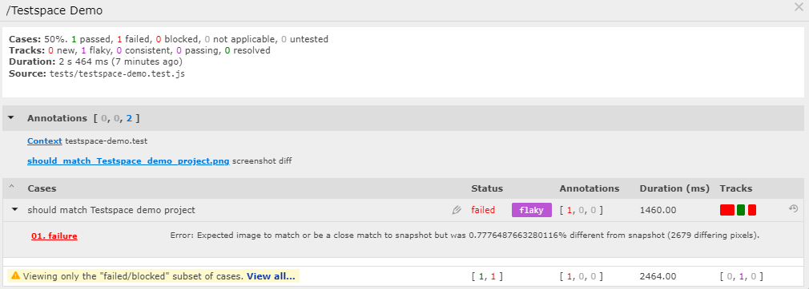
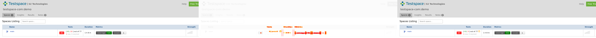

# Example Jest Puppeteer Capturing Screenshots
*Example repo* to show how Jest, Puppeteer, and Testspace can work together to capture screenshots of test failures. The repo demonstrates how to get `screenshots` of failing tests and attaches them to the associated `suite` when publishing test results to Testspace.

There are two use cases supported:
  1. Capture a screenshot of a test failure
  2. Capture an image difference when a visual test fails using the [jest image snapshot](https://github.com/americanexpress/jest-image-snapshot) package

When publishing Results to Testspace the following command line is used:

```
testspace junit.xml @./screenshots-list.txt
```

The following is an example of the **2 tests** passing and being published to [Testspace](https://testspace-com.testspace.com/projects/67670/spaces).
<br>



Next shows the **Testspace Demo** test failing:
<br>



When selecting the **Testspace Demo** suite, refer to the **Annotations** listing "`should_match_Testpace_demo_project.png`":

<br>



When clicking on the link, the following image generated by the [jest-image-snapshot](https://github.com/americanexpress/jest-image-snapshot) package is available: 




> **Note**. The visual test image was created "without" the [exemption](https://help.testspace.com/dashboard/space-failures#exemptions), thus forcing a failure for demonstration purposes. 

## Usage
To play around with this example:
- fork the repo
- Enable workflows (required when forking a repo)
- Install the Testspace app - https://github.com/marketplace/testspace-com
- Create a Testspace project based on your repo

> **Note**. You can run the tests using GitHub Actions, with a `push` or  `workflow dispatch` event.

Refer to the [Help Tutorial](https://help.testspace.com/tutorial/setup) for instructions for setting up a Testspace project. 

## Customization

### Puppeteer
To enable the attachment of images automatically on test failures, the [Puppeteer Environment](
https://github.com/argos-ci/jest-puppeteer#extend-puppeteerenvironment) is required to be extended.

- Determine the test case name
- Create the screenshot associated with the test failure
- Find the screenshot difference image on visual test failure

Refer to `jest-puppeteer-custom-env.js` and `jest-puppeteer-custom-global-setup.js` for specific details.

### Testspace
To support attaching screenshots/images, a Testspace [content list file](https://help.testspace.com/publish/push-data-results#content-list) is used. When a test fails, an image is created (or used if auto-generated) and an entry is added to the content list file. The image name is based on the test case name.

An example content list file entry (`screenshots-list.txt`):

```
"[Suite Name]+./screenshots/test case name.jpeg{screenshot}"
```

When publishing the following command line is used:
```
testspace junit.xml @./screenshots-list.txt
```

When publishing content to a folder the following syntax is required:
```
testspace junit.xml @./screenshots-list.txt '#/FOLDER`
```

Note, publishing always include the content list, even when empty.


## Repo Setup
The following steps are required to setup from scratch.

`.gitignore`
```
node_modules
junit.xml
screenshots-list.txt
screenshots
tests/__image_snapshots__/__diff_output__
```
### Packages

Create initial `package.json` file.
```
npm init -y
```

```
npm install --save-dev jest-puppeteer puppeteer jest
npm install --save-dev jest-image-snapshot
npm install --save-dev jest-junit
```

> **Note** Be sure to configure [jest-junit](https://www.npmjs.com/package/jest-junit) in the `package.json` file.

```
"jest-junit": {
    "suiteNameTemplate": "{filepath}",
    "classNameTemplate": "{classname}",
    "titleTemplate": "{title}",
    "includeShortConsoleOutput": "true"
},
```